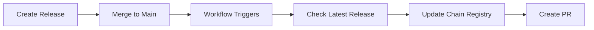

# Cosmos Chain Registry Sync Workflow

This document explains how to set up and use the automated workflow that syncs Xion releases to the [Cosmos Chain Registry](https://github.com/cosmos/chain-registry).

## Overview

The `sync_to_cosmos_chain_registry.yaml` workflow automatically:

1. **Detects new releases** - Monitors for new releases in the `burnt-labs/xion` repository
2. **Extracts version information** - Gets binary URLs, checksums, and dependency versions
3. **Updates chain registry** - Modifies `xion/chain.json` and `xion/versions.json` in cosmos/chain-registry
4. **Creates pull requests** - Automatically opens PRs similar to [this example](https://github.com/cosmos/chain-registry/pull/6455)

## Setup Required

### 1. GitHub Personal Access Token

Since this workflow creates PRs in an external repository (`cosmos/chain-registry`), you need a GitHub Personal Access Token with appropriate permissions:

> **Note**: The workflow can **detect new releases** without a token (uses public GitHub API), but needs the token to create PRs and check for duplicates.

1. Go to GitHub Settings → Developer settings → Personal access tokens → Fine-grained tokens
2. Create a new token with these permissions for the `cosmos/chain-registry` repository:
   - **Contents**: Write (to push to branches)
   - **Pull requests**: Write (to create and update PRs)
   - **Issues**: Write (required for PR creation)
   - **Metadata**: Read (basic repository access)

3. Add the token as a repository secret:
   - Go to your repository → Settings → Secrets and variables → Actions
   - Add a new secret named `CHAIN_REGISTRY_TOKEN`
   - Paste your Personal Access Token as the value

**What requires the token:**
- ❌ Checking for duplicate PRs in cosmos/chain-registry
- ❌ Forking cosmos/chain-registry (if you don't have write access)
- ❌ Creating branches and pushing changes
- ❌ Creating pull requests

**What works without the token:**
- ✅ Release detection from burnt-labs/xion (public API)
- ✅ Downloading release binaries and checksums (public URLs)
- ✅ Parsing version information from go.mod (public file)

> **Testing tip**: You can test the first two jobs of the workflow without a token by running it manually with `workflow_dispatch`. Only the final PR creation step will fail.

### 2. Repository Permissions

Ensure the repository has the following permissions in its workflow settings:
- **Actions permissions**: Allow all actions and reusable workflows
- **Workflow permissions**: Read and write permissions for workflows

## How It Works

### Automatic Trigger (Recommended)

The workflow automatically runs when code is merged to the `main` branch:

```yaml
on:
  push:
    branches:
      - main
```

When triggered, it:
1. Checks for the latest release in `burnt-labs/xion`
2. Verifies if this release has already been processed
3. If new, extracts version info and creates a PR in cosmos/chain-registry

### Manual Trigger

You can also trigger the workflow manually:

1. Go to the Actions tab in your repository
2. Select "Sync to Cosmos Chain Registry"
3. Click "Run workflow"
4. Optionally check "Force sync" to process an already-processed release

### Test Without Token

If you want to test the release detection logic without setting up a token first:

1. Run the `Test Release Detection (No Token Required)` workflow
2. This will test release detection, binary access, and version parsing
3. It stops before PR creation, so no token is needed

## Workflow Steps

### 1. Check for New Release
- Fetches the latest release from `burnt-labs/xion` (no auth required - uses public API)
- Checks if it's already been processed by looking for existing PRs (requires token for reliable access)
- Skips if already processed (unless force sync is enabled)

### 2. Extract Version Information
- Downloads checksums and binary information
- Parses `go.mod` to extract dependency versions
- Generates structured JSON with all release metadata

### 3. Update Chain Registry
- Clones/forks the `cosmos/chain-registry` repository
- Updates `xion/versions.json` with new version entry
- Updates `xion/chain.json` with latest release information
- Creates a feature branch for the changes

### 4. Create Pull Request
- Commits changes with descriptive message
- Creates PR with detailed description matching the format from the example
- Updates existing PR if one already exists for the same release

## File Structure

The workflow updates these files in cosmos/chain-registry:

```
cosmos/chain-registry/
├── xion/
│   ├── chain.json          # Updated with latest codebase info
│   └── versions.json       # New version entry added
```

## Monitoring and Troubleshooting

### Check Workflow Status
1. Go to Actions tab in your repository
2. Look for "Sync to Cosmos Chain Registry" workflow runs
3. Click on runs to see detailed logs

### Common Issues

**Token Permission Error**
```
Error: Resource not accessible by integration
```
- Ensure `CHAIN_REGISTRY_TOKEN` is set correctly
- Verify token has write permissions for cosmos/chain-registry

**No Changes Detected**
```
No changes to commit
```
- Release may already be up to date in chain registry
- Check if the release was already processed

**Fork Issues**
```
Failed to push to origin
```
- Workflow will automatically create/use a fork if needed
- Ensure token has permission to create forks

### Manual Verification

After the workflow runs, verify:
1. PR was created in [cosmos/chain-registry](https://github.com/cosmos/chain-registry/pulls)
2. Changes include both `xion/chain.json` and `xion/versions.json`
3. Binary URLs and checksums are correct
4. Version information matches the release

## Integration with Release Process

To integrate this with your release process:

1. **Tag-based releases**: Current workflow triggers on merge to main
2. **Automatic detection**: Workflow finds the latest release automatically
3. **Duplicate prevention**: Won't create duplicate PRs for the same release

### Recommended Release Flow



## Customization

### Modify Trigger Conditions

Edit the workflow file to change when it runs:

```yaml
on:
  # Run on specific branches
  push:
    branches: [main, release/*]
  
  # Run on release creation
  release:
    types: [published]
```

### Update File Paths

If chain registry structure changes, update these paths in the workflow:

```yaml
VERSIONS_FILE: "xion/versions.json"
CHAIN_FILE: "xion/chain.json"
```

### Customize PR Format

Modify the `upgrade_info` generation in the workflow to change PR description format.

## Security Considerations

- **Token Security**: Store PAT in repository secrets, never in code
- **Minimal Permissions**: Grant only necessary permissions to the token
- **Review PRs**: Always review auto-generated PRs before merging
- **Audit Trail**: Workflow runs provide complete audit trail of changes

## Support

For issues with this workflow:
1. Check workflow run logs for error details
2. Verify token permissions and repository access
3. Review recent changes to cosmos/chain-registry structure
4. Test manually with workflow_dispatch trigger first 